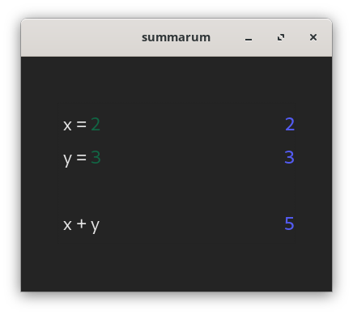

# summarum

summarum is a basic math editor.
This is what it looks like:

The idea of such a tool is not really new, it exists already. Mostly I have seen it as apps for MacOS.
A few of them are:

- [Soulver](https://soulver.app)
- [Calca](https://calca.io/)
- [Numi](https://numi.app/)
- [MathNotepad](https://mathnotepad.com/#) (by the `mathjs` author himself, which summarum also uses for evaluation)
